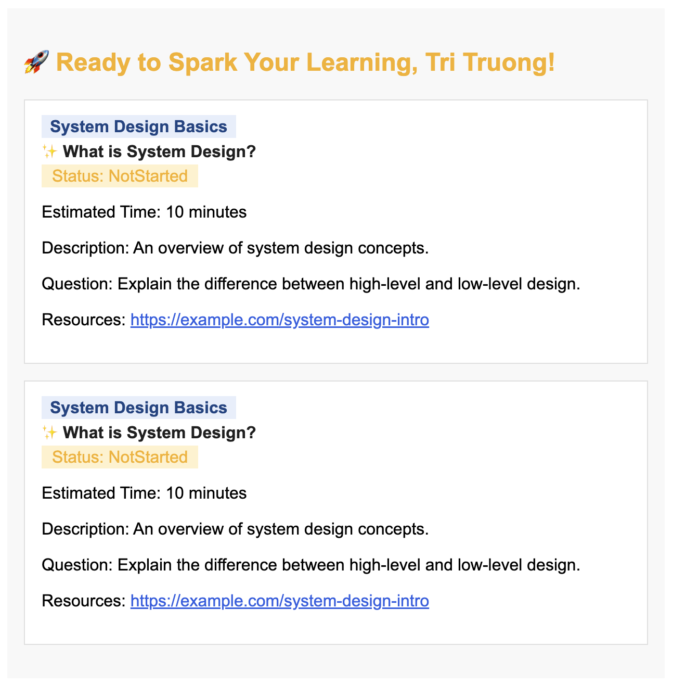

# Styling Design Doc

## Color Palette
- Blue (primary text, accents): `#2d6cdf`, `#1a4e8a`
- Light blue (backgrounds, highlights): `#eaf1fb`
- White (card background): `#fff`
- Light gray (card border): `#e3e3e3`
- Very light gray (main background): `#f9f9f9`
- Black/near-black (main text): `#222`
- Softer orange (highlight, header, status): `#f7b84a`
- Green (completed status): `#388e3c`, `#c8e6c9`

## Typography
- Font family: `Arial, sans-serif`
- Header font size: `1.15rem`, bold, color `#f7b84a`
- Course title: bold, color `#1a4e8a`, background `#eaf1fb`, padding `2px 8px`
- Topic title: bold, color `#222`, margin `4px 0`
- Status badge: background `#fff3d6` (not started) or `#c8e6c9` (completed), color `#f7b84a` or `#388e3c`, padding `2px 10px`

## Card Layout
- Card background: `#fff`
- Card border: `1px solid #e3e3e3`
- Card padding: `1rem`
- Card margin-bottom: `1rem`

## Container
- Max width: `600px`
- Margin: `2rem auto`
- Background: `#f9f9f9`
- Padding: `1rem`

## Links
- Resource links: color `#2d6cdf`, no underline unless hovered

## Example Div design
```html
<div style="max-width:600px;margin:2rem auto;font-family:Arial,sans-serif;background:#f9f9f9;padding:1rem;color:#222;">
  <h2 style="color:#f7b84a;">🚀 Ready to Spark Your Learning, Tri Truong!</h2>
  <div style="background:#fff;border:1px solid #e3e3e3;padding:1rem;margin-bottom:1rem;">
    <span style="font-weight:bold;color:#1a4e8a;background:#eaf1fb;padding:2px 8px;">System Design Basics</span>
    <div style="font-weight:600;color:#222;margin:4px 0;">✨ What is System Design?</div>
    <span style="background:#fff3d6;color:#f7b84a;padding:2px 10px;">Status: NotStarted</span>
    <p>Estimated Time: 10 minutes</p>
    <p>Description: An overview of system design concepts.</p>
    <p>Question: Explain the difference between high-level and low-level design.</p>
    <p>Resources: <a href="https://example.com/system-design-intro" style="color:#2d6cdf;">https://example.com/system-design-intro</a></p>
  </div>
</div>
```

### Sample Output


## Notes
- Avoid complex effects (no transitions, no box-shadow, no border-radius for email compatibility)
- Use only essential styles for clarity and compatibility